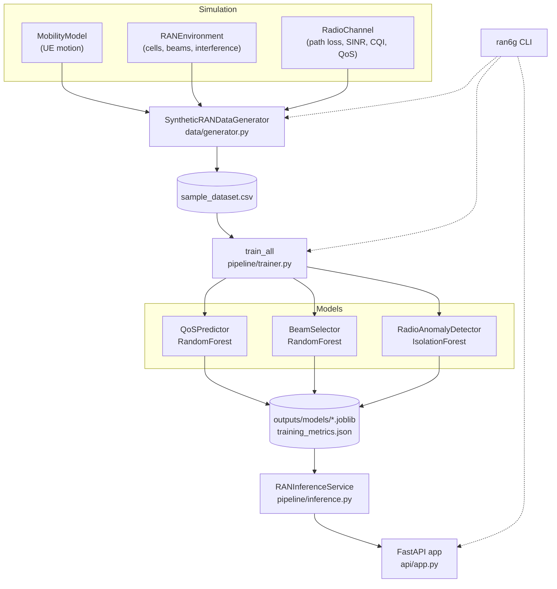

# Architecture

The system is organized as a set of independent modules that flow from
synthetic data generation, through model training, to online serving.

## Component overview

## Data flow

1. **Simulation** — `MobilityModel` moves UEs across a 2D area; `RANEnvironment`
   places cells, computes beam gains and multi-cell interference; `RadioChannel`
   turns geometry into radio metrics (RSRP, SINR, CQI) and outcomes (QoS,
   throughput, latency).
2. **Generation** — `SyntheticRANDataGenerator` samples per-UE/per-timestep rows
   and writes `sample_dataset.csv`. The key engineered feature is
   `azimuth_to_cell`, the angle-of-departure from the serving cell that
   determines the optimal beam.
3. **Training** — `train_all` fits the three models and persists artifacts plus a
   `training_metrics.json` (metrics, per-model feature importances, run metadata).
4. **Serving** — `RANInferenceService` loads the artifacts; the FastAPI app
   exposes single and batch prediction endpoints, plus `/health`, `/model_info`,
   and `/metrics`.

## Key design choices

| Choice | Rationale |
|--------|-----------|
| Central `ran6g.config` paths (env-overridable) | Same code runs in Colab, containers, and CI |
| Models loaded in FastAPI **lifespan**, not import | Cheap, side-effect-free imports; testable startup |
| `train / predict / predict_batch / save / load` interface | New models slot into the pipeline unchanged |
| `azimuth_to_cell` feature | Physically-correct signal for beam selection |

## Configuration

| Variable          | Default                   | Purpose                    |
|-------------------|---------------------------|----------------------------|
| `RAN6G_DATA_PATH` | `data/sample_dataset.csv` | Synthetic dataset location |
| `RAN6G_MODEL_DIR` | `outputs/models`          | Trained model artifacts    |
| `RAN6G_PLOT_DIR`  | `outputs/plots`           | Generated plots            |
| `RAN6G_LOG_LEVEL` | `INFO`                    | Logging verbosity          |

## API surface

| Endpoint | Method | Purpose |
|----------|--------|---------|
| `/health` | GET | Liveness + which models are loaded |
| `/model_info` | GET | Training metrics/metadata of loaded models |
| `/metrics` | GET | In-process request counts, errors, avg latency |
| `/predict_qos` | POST | Single QoS classification |
| `/select_beam` | POST | Single optimal-beam prediction |
| `/detect_anomaly` | POST | Single anomaly score |
| `/predict_qos/batch` | POST | Vectorized QoS over a list |
| `/select_beam/batch` | POST | Vectorized beam over a list |
| `/detect_anomaly/batch` | POST | Vectorized anomaly over a list |
